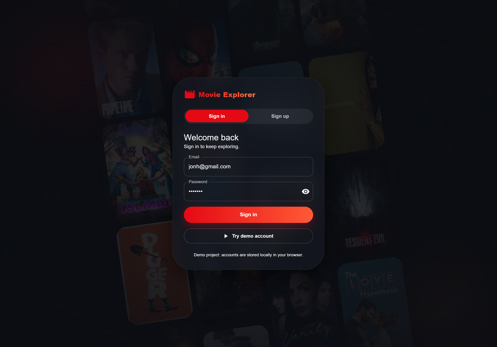
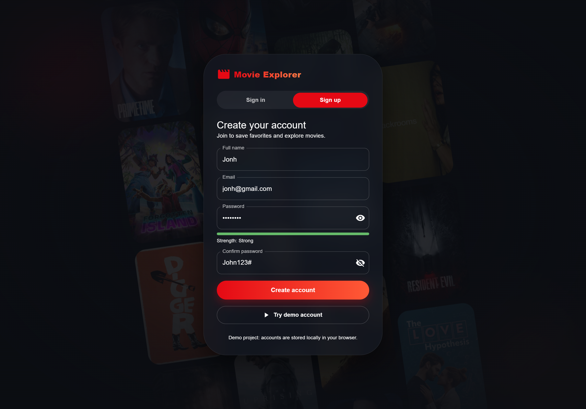
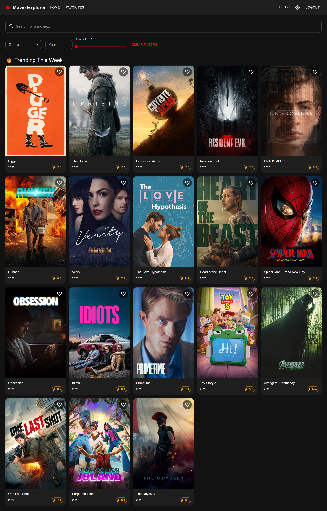
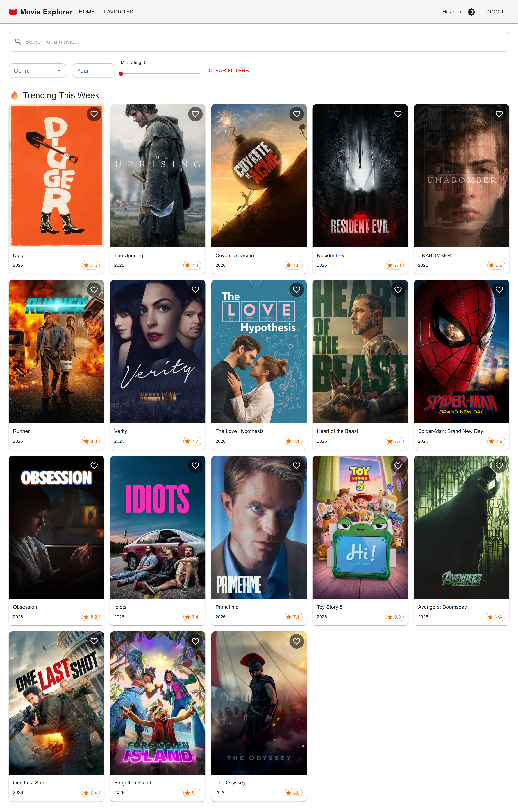
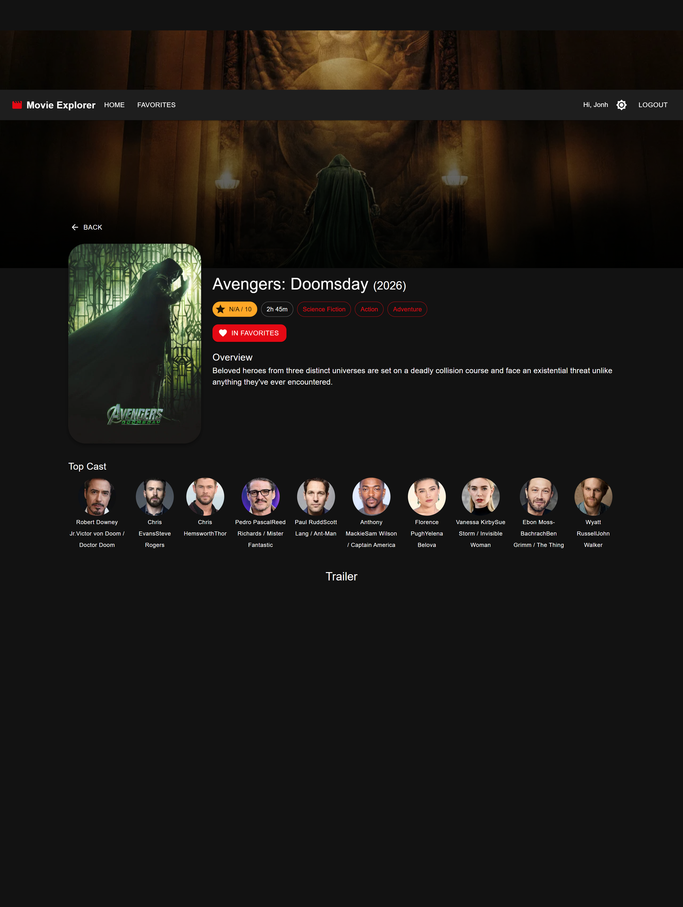
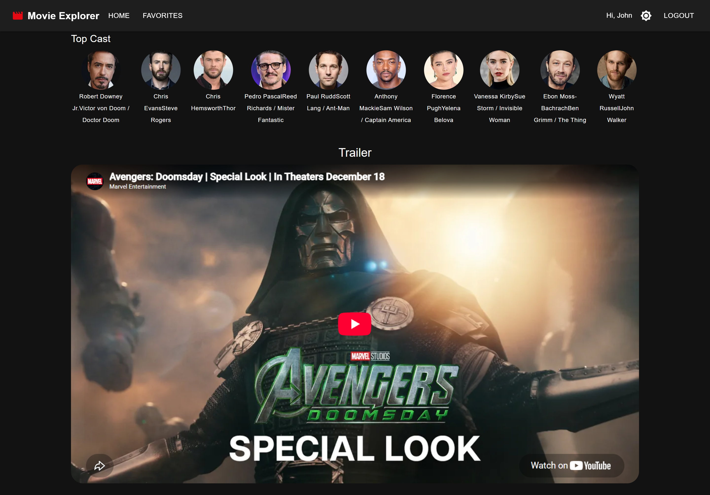
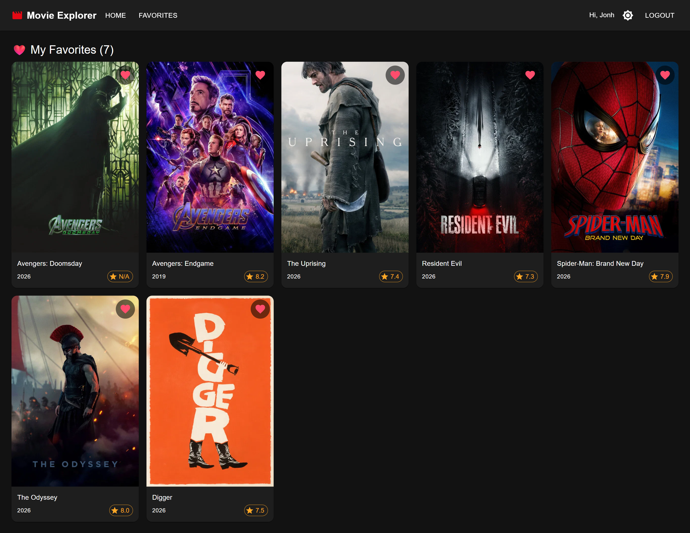
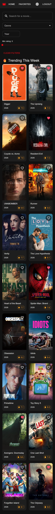
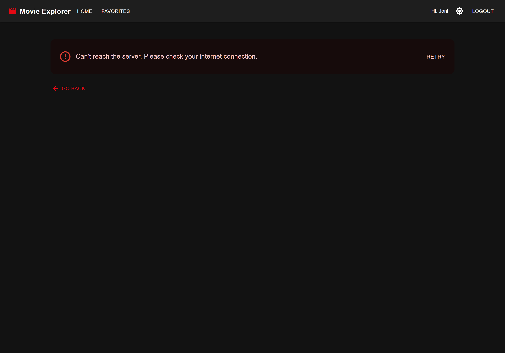
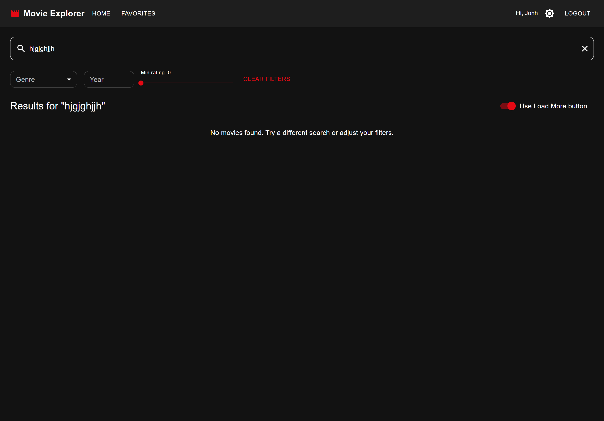

# 🎬 Movie Explorer

A responsive React web app for searching movies, browsing what's trending, watching trailers, and saving favorites. All movie data comes from the [TMDb API](https://developers.themoviedb.org/3).

|                |                                                                                             |
| -------------- | ------------------------------------------------------------------------------------------- |
| **Live demo**  | `<PASTE YOUR VERCEL LINK HERE>`                                                             |
| **Repository** | `https://github.com/Tharindu-Dharmadasa/movie-explorer.git`                                 |
| **Demo login** | Click **"Try demo account"** on the login page, or use `demo@movieexplorer.com` / `demo123` |

---

## 📸 Screenshots

### 1. Login page: Sign in



### 2. Sign up with password strength



### 3. Home: trending (dark mode)



### 4. Home: trending (light mode)



### 5. Search results


### 6. Filters (genre, year, rating)


### 7. Movie details



### 8. Cast and trailer



### 9. Favorites



### 10. Mobile view



### 11. Error handling (optional)



### 12. Empty state (optional)



---

## ✨ Features

**Core requirements**

- Login and sign up with validation, plus a one-click demo account
- Search bar with debounce (waits until you stop typing) and **infinite scrolling**
- Movie grid showing poster, title, release year, and rating
- Movie details: overview, genres, runtime, cast, and embedded YouTube trailer
- Trending movies section (18 movies, refreshed weekly by TMDb)
- Light / dark mode, remembered between visits
- Friendly loading skeletons, error messages with Retry, and empty states
- State managed with the **React Context API**
- Last search saved in **localStorage** and restored on return
- Favorites list saved in localStorage
- React Router navigation: Home, Movie Details, Favorites
- Mobile-first responsive layout

**Bonus features**

- Filter by **genre, year, and minimum rating**
- **Load More** button as an alternative to infinite scroll (switch on the Home page)
- **YouTube trailers** embedded from TMDb video data

**Extras**

- Animated login page with a scrolling poster background and password strength meter
- Favorites and last search are stored **per user**
- Reduced-motion support: login page animations turn off automatically for users who enable "Reduce motion" in their OS
- Unit tests for utilities and components

---

## 🧰 Tech stack

| Area      | Tools                        |
| --------- | ---------------------------- |
| Framework | React (Create React App)     |
| Routing   | React Router v6              |
| UI        | Material-UI (MUI) + Emotion  |
| HTTP      | Axios                        |
| State     | React Context API            |
| Data      | TMDb API v3                  |
| Testing   | Jest + React Testing Library |
| Hosting   | Vercel                       |

---

## 🚀 Getting started

### Prerequisites

- Node.js 18 or newer, and npm
- A free TMDb API key: https://www.themoviedb.org/settings/api (use the **v3 API Key**)

### Installation

```bash
git clone <your-gitlab-repo-url>
cd movie-explorer
npm install
```

### Environment variables

Copy the example file and add your key:

```bash
cp .env.example .env
```

```
REACT_APP_TMDB_API_KEY=your_api_key_here
REACT_APP_TMDB_BASE_URL=https://api.themoviedb.org/3
REACT_APP_TMDB_IMAGE_URL=https://image.tmdb.org/t/p
```

Restart the dev server after editing `.env`.

### Scripts

| Command         | What it does                             |
| --------------- | ---------------------------------------- |
| `npm start`     | Runs the app at http://localhost:3000    |
| `npm test`      | Runs the unit tests                      |
| `npm run build` | Creates the production build in `build/` |

---

## 🗂 Project structure

```
src/
├── api/          # axios instance + movie service (all TMDb calls)
├── components/
│   ├── auth/     # PosterWall (login background)
│   ├── common/   # Loader, ErrorMessage
│   ├── layout/   # Navbar, ProtectedRoute
│   ├── movies/   # MovieCard, MovieGrid, CastList, TrailerPlayer
│   └── search/   # SearchBar, FilterBar
├── context/      # Auth, Theme, Movie, Favorites
├── hooks/        # useDebounce, useInfiniteScroll
├── pages/        # Login, Home, MovieDetails, Favorites, NotFound
└── utils/        # storage, imageUrl, formatters
```

Full details are in [docs/ARCHITECTURE.md](docs/ARCHITECTURE.md).

---

## 🔌 API usage

All requests go through one axios instance (`src/api/tmdb.js`) that adds the API key and converts errors into friendly messages.

| Feature                 | TMDb endpoint                                       |
| ----------------------- | --------------------------------------------------- |
| Trending                | `GET /trending/movie/week`                          |
| Search                  | `GET /search/movie`                                 |
| Details, cast, trailers | `GET /movie/{id}?append_to_response=videos,credits` |
| Genre list              | `GET /genre/movie/list`                             |
| Filters                 | `GET /discover/movie`                               |

More detail is in [docs/API_USAGE.md](docs/API_USAGE.md).

---

## 🧠 How it works (short version)

- **State:** four Context providers (Auth, Theme, Movies, Favorites). Movies and Favorites are remounted per user so one account's data never leaks to another.
- **Search:** input is debounced by 500ms. Each request gets an ID, and responses from outdated requests are ignored so old results never overwrite new ones.
- **Infinite scroll:** an `IntersectionObserver` watches an invisible element below the grid and loads the next page when it comes into view.
- **Filters:** TMDb's search endpoint can't filter by genre or rating. With no search text, filters use `/discover/movie`. With search text, the year is sent to the API and genre and rating are filtered in the browser.
- **Persistence:** theme, session, favorites, last search, and the Load More preference are saved in localStorage.

---

## 🧪 Testing

```bash
npm test
```

Covers the formatting helpers and the `MovieCard` component (rendering and favorite toggling with localStorage). See [docs/TESTING.md](docs/TESTING.md) for the manual test checklist.

---

## 🌐 Deployment

Deployed on **Vercel**. A `vercel.json` rewrite keeps client-side routes working on refresh.

---

## ⚠️ Notes and limitations

- **Authentication is simulated.** There is no backend. Accounts are stored in the browser's localStorage, with passwords hashed using SHA-256. A production app would authenticate on a server.
- Favorites and searches live in one browser only and do not sync across devices.

## 🔮 Future improvements

- Real backend authentication
- React Query for caching and background refresh
- TypeScript
- End-to-end tests
- "Similar movies" recommendations on the details page

---

## Author

**`Tharindu Dharmadasa`**
`tharindudayan27@gmail.com` · `linkedin.com/in/tharindu-dharmadasa0927`
